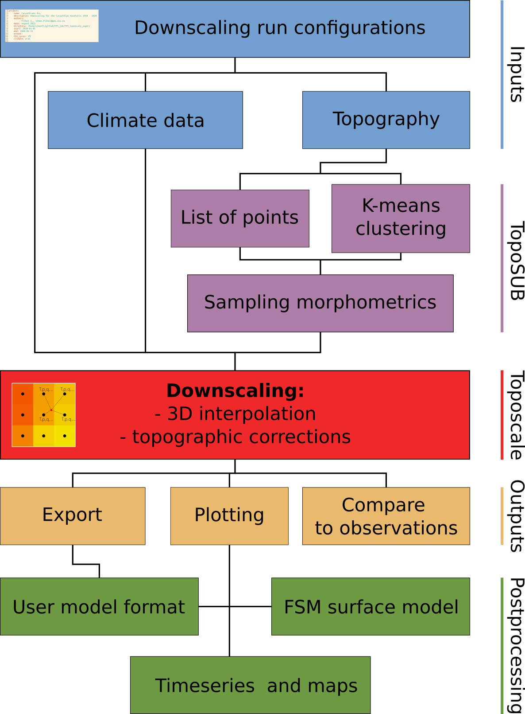

# Summary

Global climate reanalyses and projections are available worldwide for the past and coming century. However, model grids remain too coarse to be directly relevant at the hillslope-scale [@fanetal2019], requiring adapted downscaling tools to account for the effects of local topography. Mountain regions are experiencing accelerated warming with the cryosphere rapidly responding to climate change. To understand and study geomorphological, hydrological, and glaciological changes, we need tools to downscale meteorological timeseries for the basic atmospheric variables used to solve surface energy and mass balance in process-based models. Advanced dynamical downscaling methods exist, though they come with a high computational cost and complex technical setup [@Kruyt2022]. `TopoPyScale` uses a pragmatic approach to downscaling by minimizing complexity, reducing computational cost, simplifying interoperability with land surface models, while retaining physical coherence and allowing the primary drivers of land surface-atmosphere interaction to be considered. The toolbox is designed to be flexible in its usage and development.

# Statement of need

`TopoPyScale` is a community supported open-source Python package for performing climate downscaling following the initial work of @fiddesTopoSCALEDownscalingGridded2014 and @fiddesTopoSUBToolEfficient2012. It is designed as a toolbox combining computationally efficient methods to downscale climate reanalysis and projections [@hersbachERA5GlobalReanalysis2020]. At the moment, atmospheric climate models are typically run at a coarse spatial resolution (25 km for ERA5), missing the heterogeneity imposed by the topography of mountain ranges on atmospheric variables. \autoref{fig:temp_comp} shows an example of a downscaled temperature field for January 1, 2020 at 12:00 computed with `TopoPyScale` using ERA5 data as input. `TopoPyScale` allows one to reconstruct the variability of temperatures observed in between valleys and mountain tops within one single ERA5 grid cell. This method is now used in a number of studies to investigate geophysical processes such as geomorphological dynamics of permafrost [@esurf-2022-39], the hydrology of mountain catchments [@hess-23-4717-2019], mountain glaciers [@tc-2021-380] and downscaling hillslope-scale climate projections [@gmd-15-1753-2022]. The ease of use as well as the low computational cost help scientists to quickly obtain hillslope-scale atmospheric forcing data that is representative for their study domain. This new implementation of TopoSCALE into `TopoPyScale` brings a new software architecture facilitating development and usage. It is fully developed within the Python ecosystem of scientific computing libraries, thereby integrating every processing steps into a single workflow.

# Toolbox methods and structure

`TopoPyScale` is built on keystone pythonic libraries like [pandas](https://pandas.pydata.org/) [@reback2020pandas], [xarray](https://docs.xarray.dev/en/stable/) [@hoyer2017xarray] with parallelization thanks to [dask](https://docs.dask.org/en/stable/) [@dask_library] and Python multiprocessing, [topocalc](https://github.com/USDA-ARS-NWRC/topocalc) and [pvlib](https://pvlib-python.readthedocs.io/en/stable/index.html) [@Holmgren2018] for computation of metrics related to topography and solar position, [scikit-learn](https://scikit-learn.org/stable/) [@scikit-learn] for the clustering algorithm, [rasterio](https://rasterio.readthedocs.io/en/latest/index.html) [@gillies_2019] and [pyproj](https://pyproj4.github.io/pyproj/stable/) for handling geospatial data.

{ width=50% }

`TopoPyScale` consists of a set of tools to be run in a processing pipeline following the diagram of \autoref{fig:figure2}. First, it takes a Digital Elevation Model (DEM), and climate data as inputs. The climate data must include air temperature, pressure, specific humidity, and meridional and zonal wind components from atmospheric pressure levels ranging from mean sea level to above the highest elevation of the DEM, as well as incoming shortwave radiation, incoming longwave radiation, and precipitation from the surface level. The next step is to compute terrain morphometrics such as slope, aspect, and sky view factor. Then, downscaling can be run in two modes, 1) *point*, or 2) *TopoSUB* downscaling. *Point* downscaling is used for a list of specific points (*e.g.* weather station locations), for which meteorological variables are downscaled only at the coordinates of given points. The *TopoSUB* approach [@fiddesTopoSUBToolEfficient2012] is instead executed for semi-distributed spatial downscaling (\autoref{fig:figure2}). The DEM is clustered based on morphometrics. *Toposcale*, the downscaling routine, is then run only for the centroid of each cluster or the list of given points. This method efficiently abstracts the DEM into a limited number of representative points as opposed to all the DEM grid cells, with potentially several orders of magnitude of computational effort saved. `Toposcale` uses 3D spatial interpolation and geometrical corrections to downscale the meteorological variables (see Table 1). The results can then be exported in a number of formats that can be used as forcing for specialized land surface models for snow, permafrost or hydrology via readily extendable plugins. Currently, this includes the models Cryogrid [@gmd-16-2607-2023], Crocus [@gmd-5-773-2012], SNOWPACK [@BARTELT2002123], Snowmodel [@ADistributedSnowEvolutionModelingSystemSnowModel], Geotop [@gmd-7-2831-2014], and the data assimilation toolkit MuSA [@gmd-15-9127-2022]. Finally, 1D results can be mapped back to the full DEM in order to generate spatially complete results. `TopoPyScale` also includes a toolbox to perform snow simulations with [FSM](https://github.com/RichardEssery/FSM) [@gmd-8-3867-2015], and data assimilation of fractional snow-covered area [@hess-23-4717-2019].

**Table 1:** Default output variables of `TopoPyScale` (based on ERA5).

| Name                         | Variable  | Unit               | Downscaling type                                             |
| ---------------------------- | --------- | ------------------ | ------------------------------------------------------------ |
| 2 m Air Temperature          | t         | K                  | Horizontal and vertical interpolation                        |
| 2 m Air atmospheric pressure | p         | bar                | Horizontal and vertical interpolation                        |
| 10 m Wind speed              | ws        | m.s-1   | Horizontal and vertical interpolation                        |
| 10 m Wind direction          | wd        | degree             | Horizontal and vertical interpolation                        |
| 10 m Wind U-component        | u         | m.s-1   | Horizontal and vertical interpolation                        |
| 10 m Wind V-component        | v         | m.s-1   | Horizontal and vertical interpolation                        |
| 2 m Specific air humidity    | q         | kg.kg-1 | Horizontal and vertical interpolation                        |
| Precipitation rate           | tp        | mm.hr-1 | Horizontal and vertical interpolation (optional: lapse-rate) |
| Longwave radiation           | LW        | W.m-2   | Geometrical and atmospheric correction                       |
| Shortwave radiation          | SW        | W.m-2   | Geometrical and atmospheric correction                       |
| Direct shortwave radiation   | SW_direct | W.m-2   | Geometrical and atmospheric correction                       |

# Working examples

The repository [TopoPyScale_examples](https://github.com/ArcticSnow/TopoPyScale_examples) provides applications of `TopoPyScale` to three independent regions:

- The site of [Finse](https://www.mn.uio.no/geo/english/research/groups/latice/infrastructure/) in Southern Norway. Located at 1200 m above sea level, Finse is equipped with a wide range of instruments for atmospheric and hydrological studies since 2016. In this example `TopoPyScale` is run for the weather station location.
- The mountain range of Retezat in the Romanian Carpathian mountains. This is an example for applying the *TopoSUB* subroutine for spatialized downscaling.
- The area of Davos, Switzerland, specifically selected for studies on snow distribution and avalanches. This example shows how `TopoPyScale` can be combined within the same workflow as the snow model FSM.

# Acknowledgements

SF was funded from ClimaLand, an EEA/EU collaboration grant between Norway and Romania 2014-2021, project code RO-NO-2019-0415,1290 contract no. 30/2020. JF was funded by the Swiss National Science Foundation (grant no. 179130). KA was funded by ESA Permafrost_CCI (https://climate.esa.int/en/projects/permafrost/) and the Spot-On project (Research Council of Norway #301552), and acknowledges support from the LATICE strategic research area at the University of Oslo.

# References
