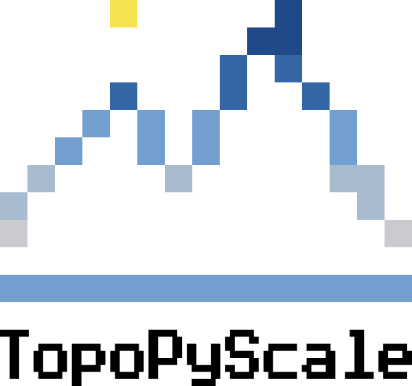

# Welcome to `TopoPyScale` Documentation


<figure markdown>
  { width="250" }
</figure>

`TopoPyScale`[@Filhol2023] is a downscaling toolbox for global and regional climate model datasets, particularly relevant to mountain ranges, and hillslopes. 

- **Source Code Repository on Github**: [https://github.com/ArcticSnow/TopoPyScale](https://github.com/ArcticSnow/TopoPyScale)
- **Examples Repository**: [https://github.com/ArcticSnow/TopoPyScale_examples](https://github.com/ArcticSnow/TopoPyScale_examples)

If you are here to use `TopoPyScale`, then head to the [Quick Start](./02_quickstart.md) page. Further configuration setup are explained in detail. 

## General Concept

`TopoPyScale` uses both climate model data and Digital Elevation Models (DEM) for correcting atmospheric state variables (e.g. temperature, pressure, humidity, *etc*). `TopoPyScale` provides tools to interpolate and correct such variables to be relevant locally given a topographical context. 

<figure markdown>
  { width="1600" }
  <figcaption>Comparison of the surface temperature on January 1, 2020 at 12:00 UTC over the Southern Carpathians, Romania, in between ERA5 Surface product and the downscaled result using `TopoPyScale`. The DEM was segmented in 2000 clusters.</figcaption>
</figure>

The most basic requirements of `TopoPyScale` is a DEM used to defined the spatial domain of interest as well as compute a number of morphometrics, and configuration file defining the temporal period, the downscaling methods and other parameters. In its current version, `TopoPyScale` includes the `topoclass` class that wraps all functionalities for ease of use. It automatically fetches data from the [ERA5](https://cds.climate.copernicus.eu/cdsapp#!/dataset/reanalysis-era5-pressure-levels?tab=overview)[@hersbach2020] repositories (Pressure and Surface levels). Other climate data sources can be added. Based on the high resolution (30-100m) DEM and the climate data, methods in the `topoclass` will compute, correct and interpolate variables need to force specialized land surface models.

`TopoPyScale` includes a number of export formats inter-operable with specialized energy and mass balance land surface models like [CRYOGRID](https://github.com/CryoGrid/CryoGridCommunity_source)[@gmd-16-2607-2023], [SURFEX](http://www.cnrm.meteo.fr/surfex/)[@le2009surfex], [CROCUS](http://bibliotheque.meteo.fr/exl-php/cadcgp.php?CMD=CHERCHE&MODELE=vues/mf_-_internet_recherche_avancee_anonyme/tpl-r.html&WHERE_IS_DOC_REF_LIT=DOC00019133&&TABLE=ILS_DOC)[@gmd-5-773-2012], [SNOWPACK](https://www.slf.ch/en/services-and-products/snowpack.html)[@BARTELT2002123], [FSM](https://github.com/RichardEssery/FSM)[@essery2015], [Snowmodel](https://srs.fs.usda.gov/pubs/26319)[@liston2006], [GEOTOP](http://geotopmodel.github.io/geotop/) or [MuSa](https://github.com/ealonsogzl/MuSA)[@gmd-15-9127-2022].

Downscaled variable includes:

- 2m air temperature
- 2m air humidity
- 2m air pressure
- 10m wind speed and direction
- Surface incoming shortwave radiation
- Surface incoming longwave radiation
- Precipitation (possibility to partition snow and rain)

## Use Cases

**Please drop us a line about your usage of TopoPyScale to be featured.** 

### SnowMapper.ch Online Dashboard

[SnowMapper](https://snowmapper.ch) is a tool that generates high-resolution maps of snow variables (snow height, snow water equivalent and snow melt) at daily timescales. The SnowMapper is an online operational snow mapping and forecasting tool for High-Mountain Central Asia (HMCA). The two main components required to achieve this are the climate downscaling tool [TopoPyscale](https://topopyscale.readthedocs.io/) and the Factorial Snow Model, [FSM](https://github.com/RichardEssery/FSM), developed by Richard Essery [@essery2015]. Visualisation and web deployment is handled by the [MCASS package](https://github.com/hydrosolutions/MCASS). SnowMapper was developed as a collaboration between the WSL Institute for Snow and Avalanche Research SLF and hydrosolutions GmbH within the SDC-funded projects CROMO-ADAPT and SAPPHIRE.

### TopoPyScale has been cited by

- @LISELLA2025122539
- @MA2024112558
- @Zweigel2023
- @philippe2025modelling
- @egusphere-2024-1404
- @jansen2024response
- @zora264138

Thanks to those who cited the tool. :)

## Quick Installation

### Release Installation
To install the latest release, in a Python 3.9/3.10 virtual environment simply use `pip`. It is adviced to first install dependencies using conda. More detailed installation instructions [here](./01_install.md).

```bash
pip install topopyscale
```

As of now, `TopoPyScale` uses the Copernicus `cdsapi` to download data. For this to work, you will need to setup the Copernicus API key in your system. Follow [this tutorial](https://cds.climate.copernicus.eu/api-how-to#install-the-cds-api-key) after creating an account with Copernicus. 

On Linux, create a file `nano ~/.cdsapirc` with inside:
```text
url: https://cds.climate.copernicus.eu/api/v2
key: {uid}:{api-key}
```

## How to Cite

You are invited to cite `TopoPyScale` when using it with the following: 

Filhol S., Fiddes J., Aalstad K., (2023). TopoPyScale: A Python Package for Hillslope Climate Downscaling. Journal of Open Source Software, 8(86), 5059, [https://doi.org/10.21105/joss.05059](https://doi.org/10.21105/joss.05059)

or in bibtex:
```bibtex
@article{Filhol2023, doi = {10.21105/joss.05059}, url = {https://doi.org/10.21105/joss.05059}, year = {2023}, publisher = {The Open Journal}, volume = {8}, number = {86}, pages = {5059}, author = {Simon Filhol and Joel Fiddes and Kristoffer Aalstad}, title = {TopoPyScale: A Python Package for Hillslope Climate Downscaling}, journal = {Journal of Open Source Software} } 

```

## Contribution

We welcome, and are pleased for any new contribution to this downscaling toolbox. So if you have suggestions, correction and addition to the current code, please come join us on [GitHub](https://github.com/ArcticSnow/TopoPyScale) and talk to us on the [Discussion](https://github.com/ArcticSnow/TopoPyScale/discussions) page.

## Funding and Support

`TopoPyScale` is currently developed by people at:

- Centre d'Etude de la Neige, Grenoble, France
- SLF, Davos, Switzerland
- [University of Oslo](https://www.mn.uio.no/geo/english/), Norway

## References

\bibliography
